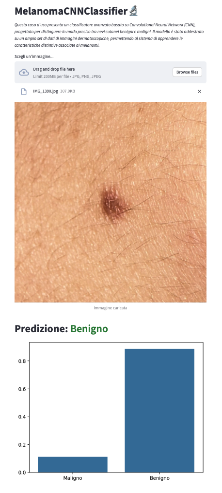

# MelanomaCNNClassifier

**Author**: RobertoCapo7

**Email**: roberto.capolongo@live.it

**Version**: 1.0

Addestramento di una CNN per distinguere i nevi benigni dai maligni

## Repository structure
```
├── data
│   ├── external       <- Data from third party sources.
│   ├── interim        <- Intermediate data that has been transformed.
│   ├── processed      <- The final, canonical data sets for modeling.
│   └── raw            <- The original, immutable data dump.
├── docs               <- Directory for documentation.
├── example            <- Directory for test scripts and src.
├── models             <- Trained and serialized models, model predictions, or model summaries.
├── notebooks          <- Directory with Jupyter notebooks.
├── references         <- Directory containing project references.
├── reports            <- Generated HTML, PDF, LaTeX, etc. reports.
│   └── figures        <- Graphs and figures generated to use in reports.
├── src                <- Project source code.
│   ├── data           <- Scripts to download or generate data.
│   ├── features       <- Scripts to turn raw data into features.
│   ├── models         <- Scripts to train and use models.        
│   └── visualization  <- Scripts to create visualizations.
├── test               <- Project test code.
│   ├── data           
│   ├── features       
│   ├── models             
│   └── visualization  
├── Makefile           <- Makefile with `make install_requirements` command.
├── README.md          <- Project markdown file created.
├── requirements.txt   <- Txt file containing all requirements to install in venv.
├── setup.sh           <- Allows you to configure git and DVC.
```
# Use
