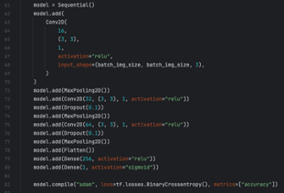
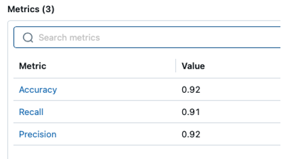
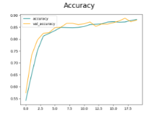
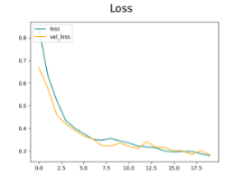
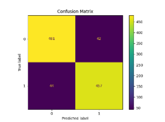
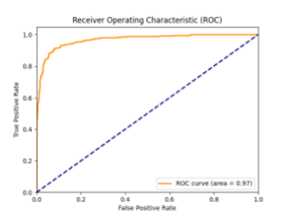

# Model Card for MelanomaCNNClassifier

<!-- Provide a quick summary of what the model is/does. -->

Questo modello è una Convolutional Neural Network (CNN) appositamente addestrata per la classificazione di nuove immagini di nevi cutanei come maligni o benigni. Analizzando attentamente le caratteristiche dell'immagine, il modello fornisce una valutazione precisa del rischio associato al neo.

## Model Details

### Model Description

<!-- Provide a longer summary of what this model is. -->

- **Developed by:** RobertoCapo7
- **Model type:** Convolutional Neural Network
- **License:** No

### Model Sources [optional]

<!-- Provide the basic links for the model. -->

- **Repository:** https://github.com/RobertoCapo7/MelanomaCNNClassifier

## Uses

<!-- Address questions around how the model is intended to be used, including the foreseeable users of the model and those affected by the model. -->

### Direct Use

<!-- This section is for the model use without fine-tuning or plugging into a larger ecosystem/app. -->

Per poter utilizzare il modello avviare il server attraverso lo script 'serverStreamLit.py', copiare il comando che da in output nel terminale e lanciarlo. Si avvierà il browser, scegli la tua immagine da classificare.

## Training Details

### Training Data

Il dataset di immagini è stato scaricato da Kaggle dal seguente link: https://www.kaggle.com/datasets/bhaveshmittal/melanoma-cancer-dataset?select=train

### Training Procedure

<!-- This relates heavily to the Technical Specifications. Content here should link to that section when it is relevant to the training procedure. -->

#### Preprocessing

Le immagini sono state pre-processate:
- Eliminate le immagini con estensione non supportata da OpenCV
- Le immagini sono state portate alla stessa risoluzione: 224 x 224 
- Equalizzazione dell’istogramma, massimizzando il contrasto delle immagini

#### Training Hyperparameters

## Evaluation

<!-- This section describes the evaluation protocols and provides the results. -->

### Testing Data, Factors & Metrics

#### Testing Data

<!-- This should link to a Dataset Card if possible. -->

Attraverso lo script 'testCNN.py' è possibile testare il modello con le immagini di test

#### Metrics

<!-- These are the evaluation metrics being used, ideally with a description of why. -->
- Precision
- Recall
- ROC
- Matrice di confusione
- Accuracy

### Results

